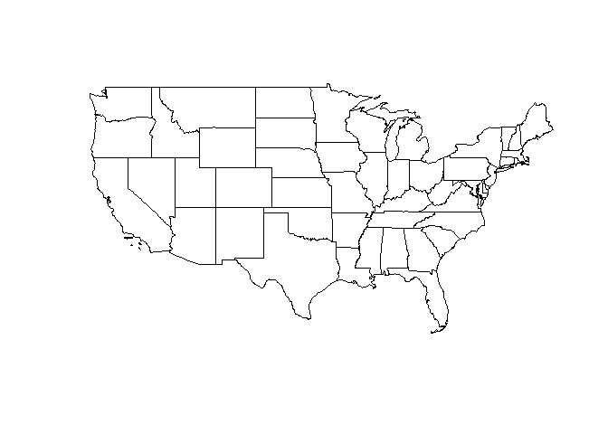
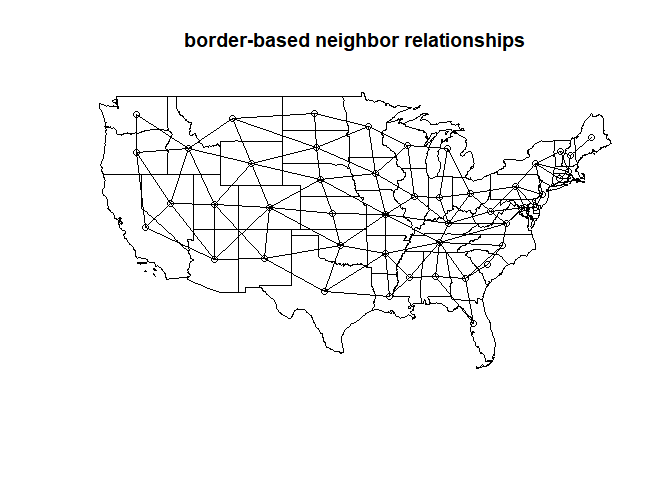
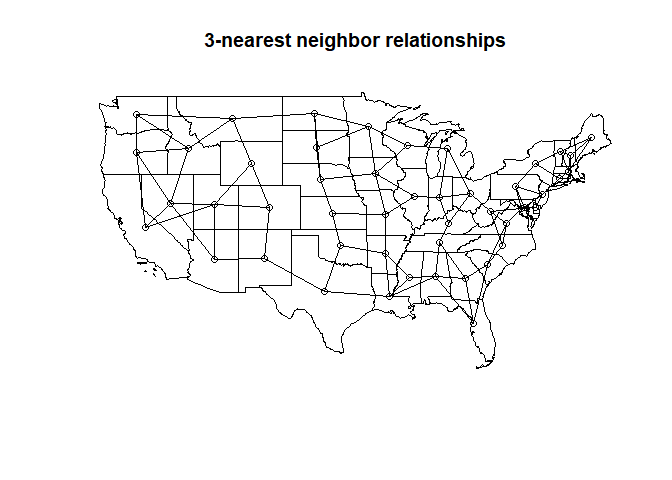
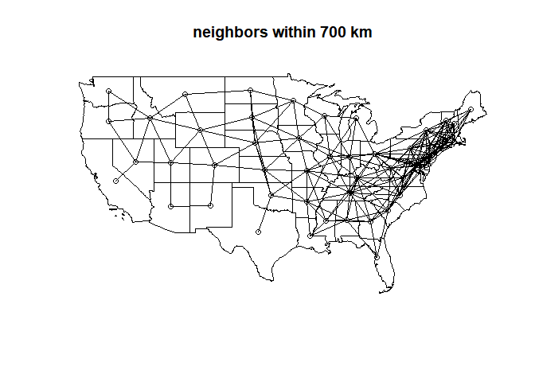

Determining neighbors from a shapefile
================
Joshua French

## Introduction

This document demonstrates approaches for determining the neighbors of
(multi)polygons imported from a shapefile. The process relies heavily on
the **sf** package (Pebesma, 2018) and the **spdep** package (Bivand and
Wong, 2018).

Specifically, we will determine which of the contiguous states (plus the
District of Columbia) in the United States are neighbors.

The materials for this demonstration are available at
\[<https://github.com/jfrench/code_demonstration/tree/main/neighbors_from_shapefile>\]

Interested parties will need to:

-   Install and load the **sf** package.
-   Install and load the **spdep** package.
-   Download and unzip `cb_2018_us_state_20m.zip` into their current
    working directory.

``` r
library(sf) # needed for spatial analysis
library(spdep)
# download zip file to working directory
download.file("https://github.com/jfrench/code_demonstration/raw/main/neighbors_from_shapefile/cb_2018_us_state_20m.zip",
              "cb_2018_us_state_20m.zip")
# unzip cb_2018_us_state_20m.zip into working directory
unzip("cb_2018_us_state_20m.zip")
```

First, we use `sf::st_read` to import the shapefile describing the state
borders. The `sf::st_read` function will import the shapefile as an `sf`
object with `MULTIPOLYGON` geometry type. We assign the name `us_states`
to this object.

``` r
# read multipolygon object
us_states <- st_read("cb_2018_us_state_20m.shp")
```

    ## Reading layer `cb_2018_us_state_20m' from data source 
    ##   `C:\Users\frencjos\Documents\OneDrive - The University of Colorado Denver\GitHub\code_demonstration\neighbors_from_shapefile\cb_2018_us_state_20m.shp' 
    ##   using driver `ESRI Shapefile'
    ## Simple feature collection with 52 features and 9 fields
    ## Geometry type: MULTIPOLYGON
    ## Dimension:     XY
    ## Bounding box:  xmin: -179.1743 ymin: 17.91377 xmax: 179.7739 ymax: 71.35256
    ## Geodetic CRS:  NAD83

Since we’re only interested in the contiguous 48 states (and the
District of Columbia so there are no “holes” in our map), we drop rows
of `us_states` for Alaska, Hawaii, and Puerto Rico. We use the native
pipe operator, `|>`, to pipe `us_states` into the first argument of the
`subset` function, from which we keep only the rows for which `NAME`
differs from Alaska, Hawaii, and Puerto Rico.

``` r
us_states <- us_states |> 
  subset(!is.element(NAME, c("Alaska", "Hawaii", "Puerto Rico")))
```

We first now visualize the contiguous `us_states` by using the
`sf::st_geometry` function to extract its geometry object and then plot
it using the `plot` function.

``` r
plot(st_geometry(us_states))
```

<!-- -->

There are many ways to determine which geometries neighbor each other.
The most common ways to define neighborhood relationships are based on
whether they share a border, are among the `k` nearest neighbors, or are
within a certain distance. We discuss each approach in turn. To simplify
the analysis, we utilize the **spdep** package. The **spdep** package
makes it easy to plot the neighbor relationships and also to test for
things like spatial dependence in the data.

## Neighbors that share a border

The `spdep::poly_nb` function can be used to determine which
multipolygon each multipolygon touches. `spdep::poly_nb` returns an `nb`
object that behaves much like a list. We assign our results the name
`nb_sf`. The `print` method (putting the `()` around the assignment)
will provide some basic information about the resulting `nb` object.

``` r
(nb_sf <- spdep::poly2nb(us_states))
```

    ## Neighbour list object:
    ## Number of regions: 49 
    ## Number of nonzero links: 218 
    ## Percentage nonzero weights: 9.07955 
    ## Average number of links: 4.44898

If we look at the first and second elements of `nb_sf`, we see that the
first multipolgyon touches multipolgyons 3, 5, 18, 35, and 45.
Similarly, the second multipolygon touches multipolygons 6, 15, 17, 25,
27, 42.

``` r
nb_sf[1:2]
```

    ## [[1]]
    ## [1]  3  5 18 35 45
    ## 
    ## [[2]]
    ## [1]  6 15 17 25 27 42

We can plot the neighbor relationships contained in `nb_sf` over our
previous map using the `plot` method for the `nb` object. The first
argument is the `nb` object to plot, the second is the centroids of each
multipolygon (which we obtain using the `sf::st_centroid` function), and
we make sure to use `add = TRUE` to draw over the previous map.

``` r
plot(st_geometry(us_states))
plot(nb_sf, st_centroid(st_geometry(us_states)), add = TRUE)
title("border-based neighbor relationships")
```

<!-- -->

Note: we can also use the `sf::st_touches` function to determine the
neighbor relationships based on borders. `sf::st_touches` will determine
the geometries each geometry touches. In this case, it will determine
which multipolygons each multipolgon touches. The results are returned
as a list and assigned the name `nb_list`. The results appear to be the
same as before. However, the `nb` object returned by the `poly2nb`
function is better for plotting.

``` r
# determine the multipolygon each multipolygon touches
nb_list <- st_touches(us_states)
# return first two results
nb_list[1:2]
```

    ## [[1]]
    ## [1]  3  5 18 35 45
    ## 
    ## [[2]]
    ## [1]  6 15 17 25 27 42

Note: the `sf::st_intersects` function is similar to `sf::st_touches`,
but lets a geometry be a neighbor with itself. Notice, the the first
multipolygon is now a neighbor with itself when using
`sf::st_intersects`.

``` r
st_intersects(us_states)[1]
```

    ## [[1]]
    ## [1]  1  3  5 18 35 45

## K-nearest neighbors

Determining neighbor relationships based on the k nearest neighbors is
also relatively straightforward. The `spdep::knearneigh` function will
determine the k nearest neighbors of an `sf` object, and then
`spdep::knn2nb` can be used to convert this to an `nb` object.

We extract the centroids of the multipolygons in `us_states` using the
`sf::st_centroid` function and assign the centroids the name
`state_centroids`. The centroids are passed to `spdep::knearneigh` with
`k=3` nearest neighbors. This is passed to the `spdep::knn2b` function,
and the resulting `nb` object is assigned the name `nb_sf_knn`.

``` r
# determine state centroids
state_centroids <- st_centroid(st_geometry(us_states))
# determine 3 nearest neighbors
nb_sf_knn <- knn2nb(knearneigh(state_centroids, k = 3))
```

We plot the knn-based neighbor relationship below. Note that each
multipolygon has only 3 neighbors! e.g., South Dakota and Nebraska in
the central part of the map aren’t neighbors with all of the states they
share borders with.

``` r
plot(st_geometry(us_states))
plot(nb_sf_knn, state_centroids, add = TRUE)
title("3-nearest neighbor relationships")
```

<!-- -->

## Distance-based neighbors

Determining neighbor relationships based on distance is also
straightforward. The `spdep::dnearneigh` function will determine the
neighbors within certain a distance of each geometry and return an `nb`
object.

The `spdep::dnearneigh` function takes an `sf` object, a lower distance
threshold (`d1`), and an upper distance threshold (`d2`). Since the
centroids are in longitude/latitude coordinates, we specify the
distances in km (see `?spdep::dnearneigh`). We’ll choose 700 km to be
the upper distance threshold for the distance-based neighbors.

``` r
nb_sf_dnn <- dnearneigh(state_centroids, d1 = 0, d2 = 700)
```

We then plot our distance-based nearest neighbor relationships below.

``` r
plot(st_geometry(us_states))
plot(nb_sf_dnn, state_centroids, add = TRUE)
title("neighbors within 700 km")
```

<!-- -->

<!-- The `sf::st_distance` function is used to compute the intercentroid distances; the resulting object is assigned the name `d`. We then `sort` each row of `d`. The second smallest distance for each row is in the 2nd row of the sorted object (the apply function transposes the output), and we find the minimum distance non-zero distance, which is 27436.33. -->
<!-- ```{r} -->
<!-- d <- st_distance(state_centroids) -->
<!-- (lower <- min(apply(d, 1, sort)[2,])) -->
<!-- ``` -->
<!-- Alternatively, we could have created a vector with the value 0, assigned it the same units as `d`, then determine the largest non-zero distance. The same result is returned. -->
<!-- ```{r} -->
<!-- d0 <- numeric(1) -->
<!-- units(d0) <- units(d) -->
<!-- min(d[d > d0]) -->
<!-- ``` -->

## References

Bivand, Roger S. and Wong, David W. S. (2018) Comparing implementations
of global and local indicators of spatial association TEST, 27(3),
716-748. <https://doi.org/10.1007/s11749-018-0599-x>

Pebesma, E., 2018. Simple Features for R: Standardized Support for
Spatial Vector Data. The R Journal 10 (1), 439-446,
<https://doi.org/10.32614/RJ-2018-009>
